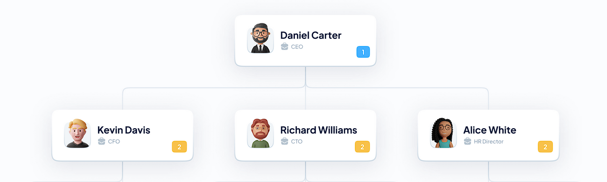
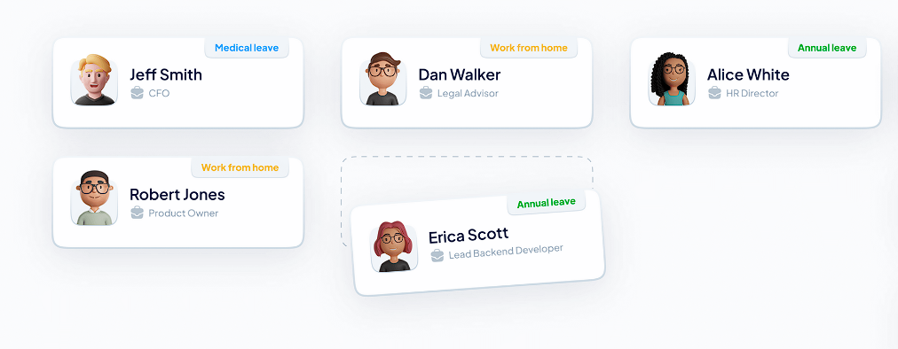

# Требования к проекту

## Содержание

[1 Введение](#1-введение)  
[1.1 Назначение](#11-назначение)  
[1.2 Бизнес-требования](#12-бизнес-требования)  
[1.2.1 Исходные данные](#121-исходные-данные)  
[1.2.2 Возможности бизнеса](#122-возможности-бизнеса)  
[1.2.3 Границы проекта](#123-границы-проекта)  
[1.3 Аналоги](#13-аналоги)  
[2 Требования пользователя](#2-требования-пользователя)  
[2.1 Программные интерфейсы](#21-программные-интерфейсы)  
[2.2 Интерфейс пользователя](#22-интерфейс-пользователя)  
[2.3 Характеристики пользователей](#23-характеристики-пользователей)  
[2.3.1 Классы пользователей](#231-классы-пользователей)  
[2.3.2 Аудитория приложения](#232-аудитория-приложения)  
[2.3.2.1 Целевая аудитория](#2321-целевая-аудитория)  
[2.3.2.2 Побочная аудитория](#2322-побочная-аудитория)  
[2.4 Предположения и зависимости](#24-предположения-и-зависимости)  
[3 Системные требования](#3-системные-требования)  
[3.1 Функциональные требования](#31-функциональные-требования)  
[3.1.1 Основные функции](#311-основные-функции)  
[3.1.1.1 Общая информация (главное меню)](#3111-Общая-информация-(главное-меню))    
[3.1.2 Ограничения и исключения](#312-ограничения-и-исключения)  
[3.2 Нефункциональные требования](#32-нефункциональные-требования)  
[3.2.1 Атрибуты качества](#321-атрибуты-качества)  
[3.2.1.1 Требования к удобству использования](#3211-требования-к-удобству-использования)  
[3.2.1.2 Требования к безопасности](#3212-требования-к-безопасности)  
[3.2.2 Внешние интерфейсы](#322-внешние-интерфейсы)  
[3.2.3 Ограничения](#323-ограничения)

# 1 Введение

## 1.1 Назначение

В этом документе описаны функциональные и нефункциональные требования к десктоп приложению 'EmployeeDataBase'. Этот документ предназначен для команды, которая будет реализовывать и проверять корректность работы приложения.

## 1.2 Бизнес-требования

### 1.2.1 Исходные данные

Огромное количество организаций, начиная с государственных учреждений и заканчивая частным бизнесом нуждаются в программном
средстве, способном вести учет сотрудников и содержать всю необходимую о них информацию. Бумажный учет имеет огромное количество недостатков и в наше время является менее надежным по сравнению с электронным. Именно поэтому создание приложения, доступного для каждой организации, имеющего удобный и простой интерфейс со всеми нужными функциями решает данную проблему.

### 1.2.2 Возможности бизнеса

Каждый работодатель нуждается в программе, которая быстро может отобразить сотрудников конкретного отдела, 
отсортировать по заработной плате, по стажу, имени или фамилии. Добавить нового работника или же удалить старого.
Данное приложение позволяет все это сделать. Интерфейс, спроектированный так, чтоб пользователю было легко и 
просто получить желаемое.

### 1.2.3 Границы проекта

Приложение 'EmployeeDataBase' позволит быстро добавлять, редактировать, сортировать сотрудников по разным критериям.
Принцип простой:

1.Администратор запускает приложение и запускает файл с акутальной базой.

2.Далее на выбор доступны действия с информацией.

3.Отображения выбранного варианта происходит в виде списка.

4.Администратор может выполнять редактирование над записями из списка.

## 1.3 Аналоги

Обзор аналогов представлен в документе [analogues](analogues.md).

# 2 Требования пользователя

Информация будет доступна для каждого администратора и хранится на сервере.

## 2.1 Программные интерфейсы

Иерархия сотрудников: 

  

Информация о состоянии сотрудника:  

  

Личная карточка сотрудника:  

  

## 2.3 Характеристики пользователей

### 2.3.1 Классы пользователей

| Класс пользователей | Описание                                                                                              |
|:--------------------|:------------------------------------------------------------------------------------------------------|
| Без доступа к сети  | Пользователи имееют доступ к информации с последней загрузки.							      |
| С доступом к сети   | Пользователи, которые имеют доступ к сети. Имеют доступ к актульной информации                         |

### 2.3.2 Аудитория приложения

#### 2.3.2.1 Целевая аудитория

Люди любой возрастной категории, обладающие минимальными навыками работы с ПК и в сети интернет.

#### 2.3.2.2 Побочная аудитория

Люди которые занимаются в сфере бизнеса, заинтересованные в удобном контроле сотрудников.

## 2.4 Предположения и зависимости

Приложение работает и при отсутствии и при наличии подключения к Интернету;

# 3 Системные требования

## 3.1 Функциональные требования

### 3.1.1 Основные функции

#### 3.1.1.1 Общая информация (главное меню)

**Описание:** Пользователь имеет возможность сортировки, поиска, добавления и удаления сотрудников.

| Функция                              | Требования                                                                                                                                                                                                                                                                                               | 
|:-------------------------------------|:---------------------------------------------------------------------------------------------------------------------------------------------------------------------------------------------------------------------------------------------------------------------------------------------------------|
| Сортировка               | Приложение позволяет вывести сотрудников отсортированных по определенному  пункту.                                                                                                                                                                                                                   		  |
| Поиск 	               | Поиск по любому параметру.                                                                                                                                                                                 				              		  |
| Добавление		               | Приложение позволяет добавить сотрудника.                                                                                                                                                       										  |
| Удаление	               | Приложение позволяет удалить сотрудника.																										  |

### 3.1.2 Ограничения и исключения

Приложение функционирует при любом состоянии подключения к интернету.

## 3.2 Нефункциональные требования

### 3.2.1 Атрибуты качества

#### 3.2.1.1 Требования к удобству использования

1. Интерфейс удобный для пользования

2. Функциональные элементы не перегружают экран;

#### 3.2.1.2 Требования к безопасности

Для ограничения доступа к редактированию определенному кругу лиц применяются учетные записи администраторов.

### 3.2.2 Внешние интерфейсы

Окна приложения удобны для долгосрочного использования пользователями:

* функциональные элементы не утомляют глаза.
* стандартная цветовая палитра не утомляет глаза.

### 3.2.3 Ограничения

Приложение реализовано на Rust/Tui    	